# HappyPaw

> Вебзастосунок для організації процесу прилаштування безпритульних тварин.
--
## Автор

- **ПІБ**: Козак Евеліна-Валентина Петрівна
- **Група**: ФеС-31
- **Керівник**: Жишкович А. В.
- **Дата виконання**: 2026

## Загальна інформація

- **Тип проєкту**: Вебзастосунок
- **Мова програмування**: JavaScript
- **Фреймворк**: Next.js
- **Бібліотека інтерфейсу**: React
- **Серверна логіка та база даних**: Convex
- **Автентифікація**: Clerk
- **Завантаження файлів**: UploadThing
- **Стилізація**: Tailwind CSS, shadcn/ui
- **Тестування**: Vitest, React Testing Library


## Опис функціоналу

- Реєстрація та вхід користувачів
- Створення та редагування профілю користувача
- Перегляд каталогу тварин
- Фільтрація тварин за основними параметрами
- Формування рекомендацій на основі вподобань користувача
- Створення, редагування та видалення оголошень про тварин
- Завантаження фотографій тварин
- Подання заявок на прилаштування
- Перегляд заявок і зміна їхнього стану
- Обмін повідомленнями між користувачами в межах заявки
- Отримання та перегляд сповіщень

## Опис основних файлів і директорій

| Файл / директорія | Призначення |
|------------------|-------------|
| `app/` | Сторінки та маршрути Next.js-застосунку |
| `app/(auth)/` | Сторінки входу та реєстрації |
| `app/(dashboard)/` | Закрита частина застосунку після авторизації |
| `app/api/uploadthing/` | Налаштування маршруту для завантаження фотографій |
| `components/` | Повторно використовувані компоненти інтерфейсу |
| `components/ui/` | Базові UI-компоненти: кнопки, поля, картки, бейджі |
| `components/layout/` | Компоненти макета та навігації |
| `components/landing/` | Компоненти стартової сторінки |
| `convex/` | Серверна логіка, запити, мутації та схема бази даних |
| `convex/schema.js` | Опис таблиць бази даних Convex |
| `convex/users.js` | Функції для роботи з користувачами |
| `convex/pets.js` | Функції для роботи з оголошеннями про тварин |
| `convex/applications.js` | Функції для роботи із заявками |
| `convex/messages.js` | Функції для повідомлень |
| `convex/notifications.js` | Функції для сповіщень |
| `lib/` | Допоміжні функції та утиліти |
| `tests/` | Автоматизовані тести |
| `middleware.js` | Захист закритих маршрутів |
| `package.json` | Залежності та команди запуску проєкту |

---

## Інструкція з запуску проєкту 

### 1. Встановлення інструментів

Для запуску проєкту потрібно встановити:

- Node.js
- npm
- Git

### 2. Клонування репозиторію

```bash
git clone https://github.com/valentin-qrw/happypaw.git
cd happypaw
```

### 3. Встановлення залежностей

```bash
npm install
```

### 4. Створення `.env.local` файлу

```bash
NEXT_PUBLIC_CLERK_PUBLISHABLE_KEY=your_clerk_publishable_key
CLERK_SECRET_KEY=your_clerk_secret_key

NEXT_PUBLIC_CONVEX_URL=your_convex_url
CONVEX_DEPLOYMENT=your_convex_deployment

UPLOADTHING_TOKEN=your_uploadthing_token
```

### 5. Запуск Convex

```bash
npx convex dev
```

### 6. Запуск застосунку

```bash
npm run dev
```

Застосунок буде доступний за адресою: `http://localhost:3000`

---

## Розгорнута версія

Вебзастосунок доступний онлайн за посиланням:

[HappyPaw на Vercel](https://happypaw-bsau.vercel.app/)

##  Основні серверні функції

### Користувачі

- `users:getUserByClerkId` — отримання користувача за ідентифікатором Clerk
- `users:createOrUpdateUser` — створення або оновлення профілю користувача
- `users:updateUserProfile` — оновлення даних профілю

### Тварини

- `pets:getPets` — отримання списку оголошень про тварин
- `pets:getPetById` — отримання детальної інформації про тварину
- `pets:createPet` — створення нового оголошення
- `pets:updatePet` — редагування оголошення
- `pets:deletePet` — видалення оголошення
- `pets:getRecommendedPets` — отримання рекомендацій на основі вподобань користувача

### Заявки

- `applications:createApplication` — подання заявки на прилаштування
- `applications:getApplicationsByApplicant` — отримання заявок, поданих користувачем
- `applications:getApplicationsByOwner` — отримання заявок на оголошення користувача
- `applications:updateApplicationStatus` — зміна стану заявки

### Повідомлення

- `messages:getMessagesByApplication` — отримання повідомлень у межах заявки
- `messages:sendMessage` — надсилання нового повідомлення

### Сповіщення

- `notifications:getNotifications` — отримання сповіщень користувача
- `notifications:getUnreadCount` — отримання кількості непрочитаних сповіщень
- `notifications:markAsRead` — позначення сповіщення як прочитаного

## Інструкція для користувача

1. **Головна сторінка** — містить короткий опис платформи та кнопки для початку роботи:
   - `Увійти/Почати прилаштування` — перехід до сторінки авторизації існуючого користувача;
   - `Почати/Додати тварину` — створення нового облікового запису;
   - `Переглянути тварин` — перехід до каталогу тварин після входу в систему.

2. **Реєстрація / Вхід** — користувач може створити обліковий запис або увійти в уже існуючий:
   - ввести email та пароль;
   - пройти автентифікацію через доступні способи входу;
   - після успішного входу отримати доступ до закритої частини застосунку.

3. **Каталог/стрічка рекомендованих тварин** — сторінка для рекомендованих перегляду оголошень про тварин:
   - картки тварин містять фото, ім’я, тип, породу, вік, розмір, локацію, статус доступності, короткий опис;
   - користувач може перейти до сторінки детального перегляду конкретної тварини.

4. **Пошук** — сторінка для перегляду каталогу та пошуку оголошень за параметрами:
   - користувач може встановлювати фільтри;
   - після вибору параметрів список оголошень оновлюється відповідно до заданих критеріїв;
   - з результатів пошуку можна перейти до сторінки конкретної тварини.


5. **Сторінка тварини** — містить повну інформацію про обране оголошення:
   - опис тварини;
   - основні характеристики;
   - фотографії;
   - інформацію стан здоров'я;
   - інформацію про автора оголошення;
   - кнопку `Подати заявку на прилаштування`, якщо тварина доступна для прилаштування.
   - кнопку `` для автора оголошення.

6. **Створення оголошення** — авторизований користувач може додати нову тварину:
   - заповнити необхідну інформацію;
   - додати додаткову інформацію;
   - завантажити фотографії тварини;
   - натиснути кнопку збереження, після чого оголошення з’явиться в каталозі.

7. **Профіль користувача** — сторінка з інформацією про користувача:
    - перегляд особистої інформації;
   - перегляд створених оголошень;
   - оновлення користувача;
   - перегляд отриманих та поданих заявок .

8. **Подання заявки** — користувач може подати заявку на прилаштування тварини:
   - перейти на сторінку обраної тварини;
   - натиснути кнопку `Подати заявку на прилаштування`;
   - заповнити анкету з інформацією про досвід догляду, житлові умови, графік роботи, наявність інших тварин і причину звернення;
   - надіслати заявку на розгляд автору оголошення.

9. **Заявки** — розділ для перегляду поданих і отриманих заявок:
   - користувач бачить заявки, які він подав;
   - автор оголошення бачить заявки, отримані на його тварин;
   - автор може змінити стан заявки, наприклад схвалити або відхилити її.

10. **Повідомлення** — сторінка для спілкування між користувачами:
   - діалог прив’язаний до конкретної заявки;
   - користувачі можуть обговорити деталі прилаштування;
   - історія повідомлень зберігається в межах відповідної заявки.

11. **Сповіщення** — розділ для перегляду важливих подій:
   - нова заявка на оголошення;
   - зміна стану заявки;
   - користувач може переглянути сповіщення та позначити їх як прочитані.

12. **Налаштування** — сторінка для редагування даних користувача:
   - оновлення імені, фото, телефону, локації та короткого опису;
   - налаштування вподобань щодо тварин;
   - збережені вподобання використовуються для формування персоналізованих рекомендацій;
   - видалення акаунта користувача з очищенням пов’язаних даних у системі.


## Приклади інтерфейсу

### Головна сторінка

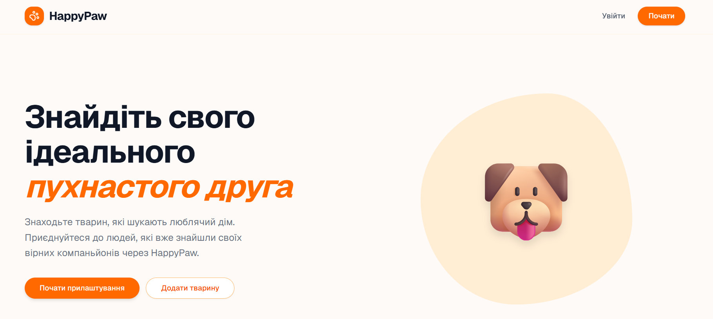

### Стрічка рекомендованих тварин

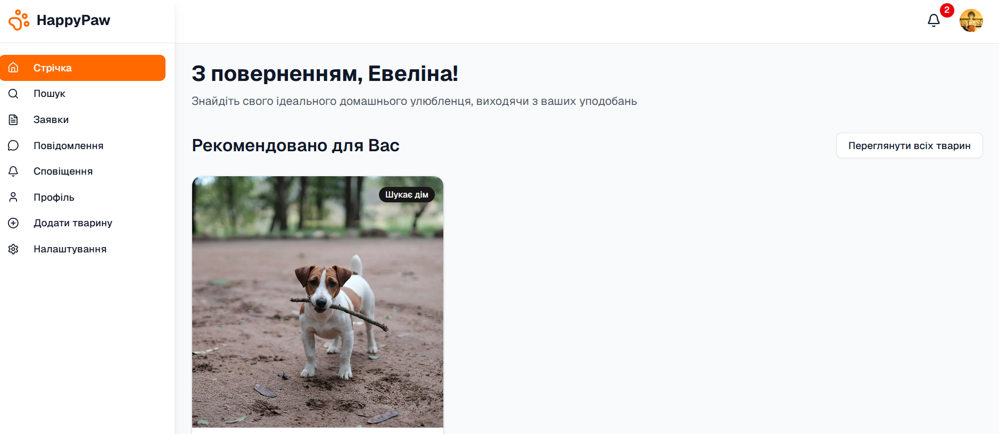

### Пошук 

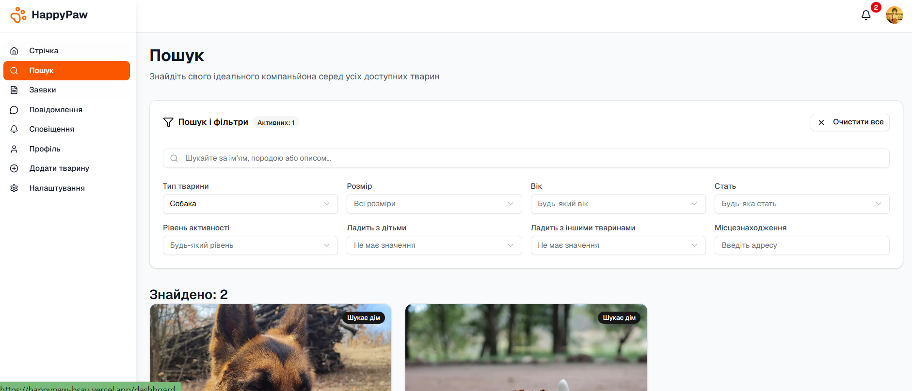


### Інформація про тварину

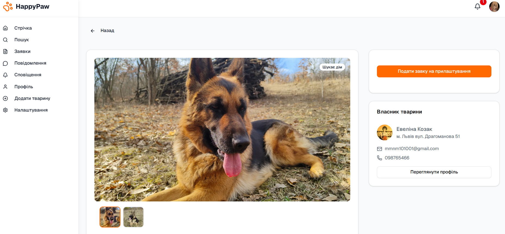
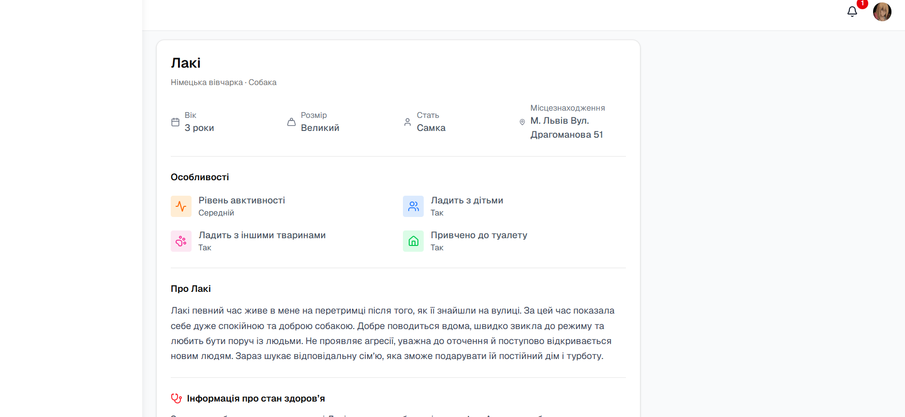

### Форма створення оголошення

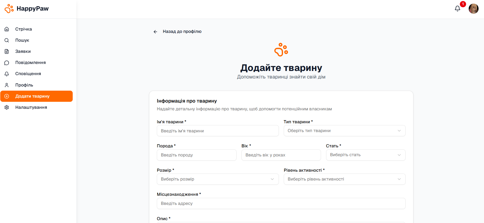

### Список заявок

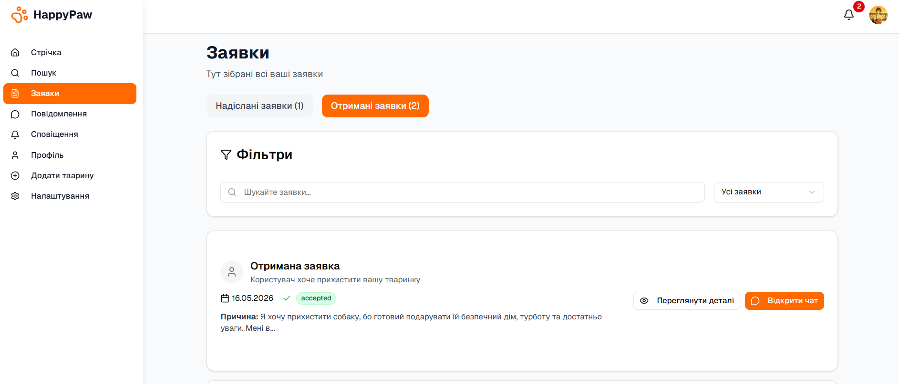

### Деталі заявки

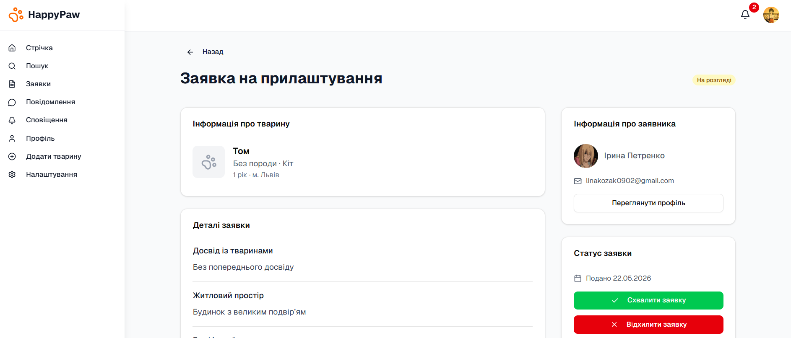

### Повідомлення

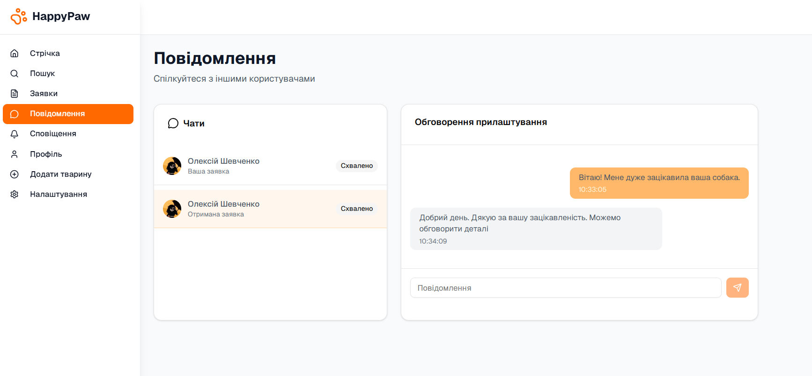

### Сповіщення

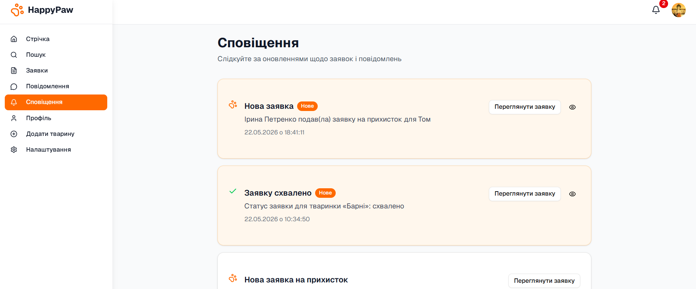

### Налаштування

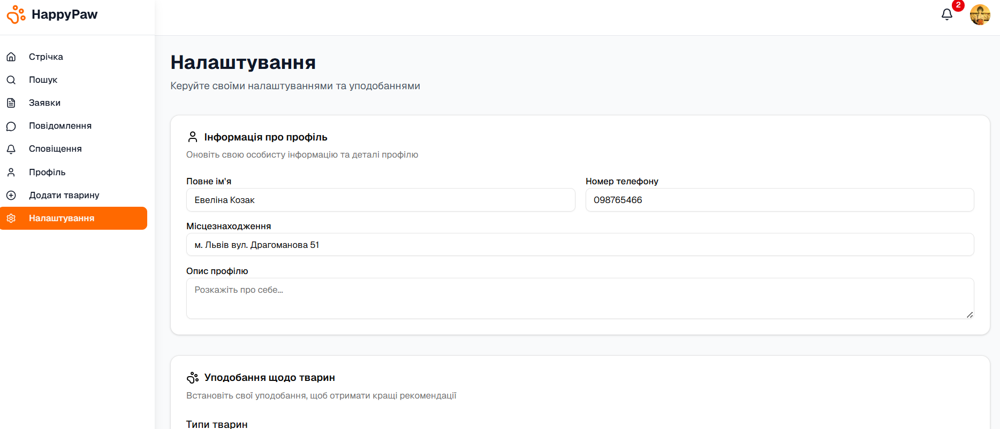

### Профіль користувача

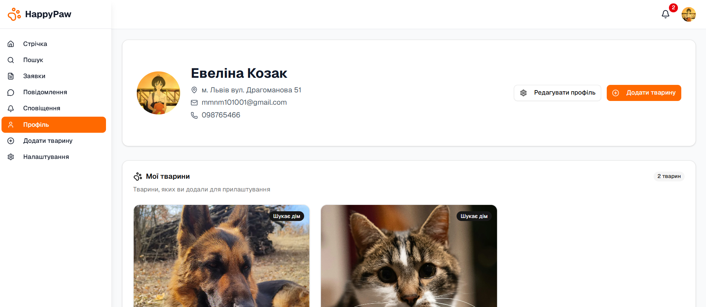

## Проблеми і рішення

| Проблема | Рішення |
|---------|---------|
| Не запускається проєкт | Перевірити, чи встановлено Node.js та виконано команду `npm install` |
| Помилка зі змінними середовища | Перевірити наявність файлу `.env.local` і правильність ключів Clerk, Convex та UploadThing |
| Не працює авторизація | Перевірити `NEXT_PUBLIC_CLERK_PUBLISHABLE_KEY` і `CLERK_SECRET_KEY` |
| Не підключається Convex | Запустити `npx convex dev` і перевірити `NEXT_PUBLIC_CONVEX_URL` |
| Не завантажуються фотографії | Перевірити `UPLOADTHING_TOKEN` і налаштування маршруту `app/api/uploadthing` |
| Зображення не відображаються | Перевірити посилання на фото та налаштування зображень у `next.config.js` |

## Використані джерела

- [Adoption Tips — ASPCA](https://www.aspca.org/adopt-pet/adoption-tips)
- [Async function — MDN Web Docs](https://developer.mozilla.org/en-US/docs/Web/JavaScript/Reference/Statements/async_function)
- Bird R., Wadler P. *Introduction to Functional Programming*. London : Prentice Hall International, 1988. 293 p.
- [Clerk Documentation](https://clerk.com/docs)
- [Convex Documentation](https://docs.convex.dev/home)
- [Convex Functions Documentation](https://docs.convex.dev/functions)
- [GitHub Docs — About Git](https://docs.github.com/en/get-started/using-git/about-git)
- [ReactiveX — Introduction](https://reactivex.io/intro.html)
- [JavaScript — MDN Web Docs](https://developer.mozilla.org/en-US/docs/Web/JavaScript)
- [Next.js Docs](https://nextjs.org/docs)
- [Promise.all() — MDN Web Docs](https://developer.mozilla.org/en-US/docs/Web/JavaScript/Reference/Global_Objects/Promise/all)
- [Convex Query Functions Documentation](https://docs.convex.dev/functions/query-functions)
- [React Documentation](https://react.dev/)
- [Serverless Computing — Amazon Web Services](https://aws.amazon.com/serverless/)
- [Tailwind CSS Documentation](https://tailwindcss.com/docs/installation/using-vite)
- [UAnimals](https://uanimals.org/)
- [UploadThing Documentation](https://docs.uploadthing.com/uploading-files)